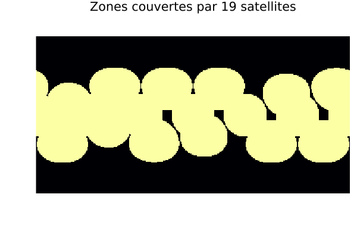

# OrbitalConstellations.jl

## Introduction

This project was developed in the context of the course **ES313 – Mathematical Modeling and Computer Simulation**
at the **Royal Military Academy (Belgium)**.

The objective of this module is to model, analyze, visualize, and optimize satellite constellations
(mainly LEO) with respect to Earth coverage, constellation geometry, number of satellites, and PDOP performance.

The codebase is written in **Julia**.  
**All comments and docstrings inside the source code are written in French.**

---

## Overview

The `OrbitalConstellations` module provides tools to:

- Define satellites and orbital planes  
- Build Walker and generalized Walker constellations  
- Compute satellite positions in ECI and ECEF frames  
- Evaluate instantaneous and average Earth coverage  
- Optimize constellations using genetic algorithms  
- Optimize constellations with a fixed number of satellites  
- Optimize constellations using PDOP-based criteria  
- Visualize constellations and coverage maps  

---

## Dependencies

This project relies exclusively on standard Julia packages:

- **LinearAlgebra** – Matrix operations, norms, eigenvalues, Cholesky decomposition, etc.
- **Plots** – 2D and 3D visualization of the Earth, satellite orbits, constellations, and coverage heatmaps.
- **Base.Threads** – Multi-threading support for accelerating coverage, PDOP, and genetic optimization computations.

---

## Installation / Usage

Place all source files in the same directory and load the module:

```julia
include("./OrbitalConstellations/OrbitalConstellations.jl")
using .OrbitalConstellations
```

---

## Examples

Below is a minimal set of examples illustrating the main features of the module: constellation definition, coverage evaluation, optimization, and visualization. 

All functions and parameters are documented through detailed docstrings (in French).
These docstrings are accessible via the Live Docs panel in Pluto notebooks, which is the recommended environment for exploring the module.

```julia
include("./OrbitalConstellations/OrbitalConstellations.jl")
using .OrbitalConstellations

P = 6
S = 4
F = 1
i_deg = 55.0
a = Re + 550e3
eps_deg = 10.0

sats = walker_delta(P, S, F, i_deg, a)      # Build a Walker-Delta constellation

vec = [4, 5, 4, 5]                          # Satellites per orbital plane
cov, N = eval_constellation(vec, F, i_deg, a, eps_deg)  # Compute mean coverage

best_vec, cov_final, N_final =
    evolve_vec(8, 16, 1, i_deg, a, eps_deg; generations = 50)  # GA with variable N

best_vec_fixed, cov_fixed =
    evolve_vec_fixedN(8, 16, 1, i_deg, a, eps_deg)             # GA with fixed N

best_vec_pdop, mpdop, cov_pdop, N_pdop =
    evolve_vec_pdop(8, 16, 1, i_deg, a, eps_deg)               # PDOP-driven GA

plot_constellation(sats, 0.0)               # 3D visualization of the constellation
show_coverage_heatmap(sats, 0.0, eps_deg)   # Earth coverage heatmap
```

## Visualizations

The following visualisations have been created using the plots created with the __plot_constellation__ and __show_coverage_heatmap__ functions.

<p align="center">
  
  <br>
  <em>3D visualization of a Walker-Delta satellite constellation.</em>
</p>

<p align="center">
  
  <br>
  <em>Earth coverage evolution over time.</em>
</p>

## Notes

- Multi-threading is used extensively for performance.  
- Caching mechanisms are implemented to accelerate genetic algorithms.  
- The Earth is assumed spherical with constant rotation.  
- Orbits are assumed circular. 
- AI assistance (OpenAI GPT-5.1 / GPT-5.2) was used for documentation and code review.
